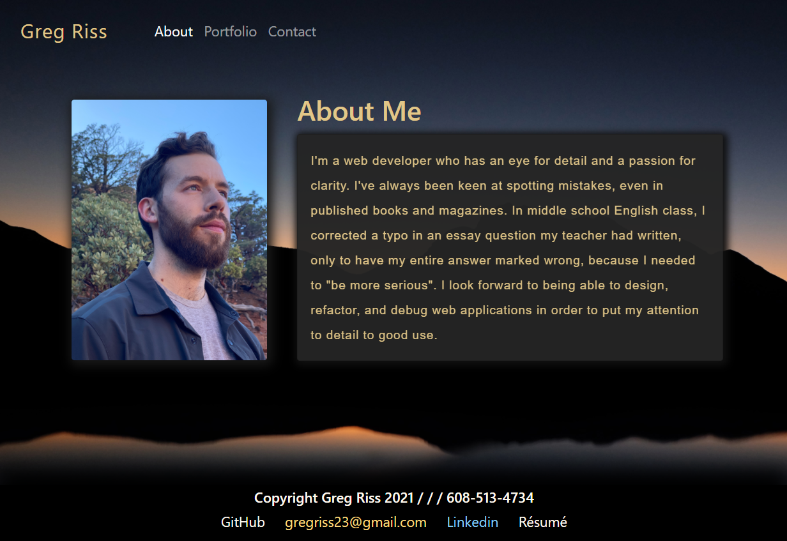
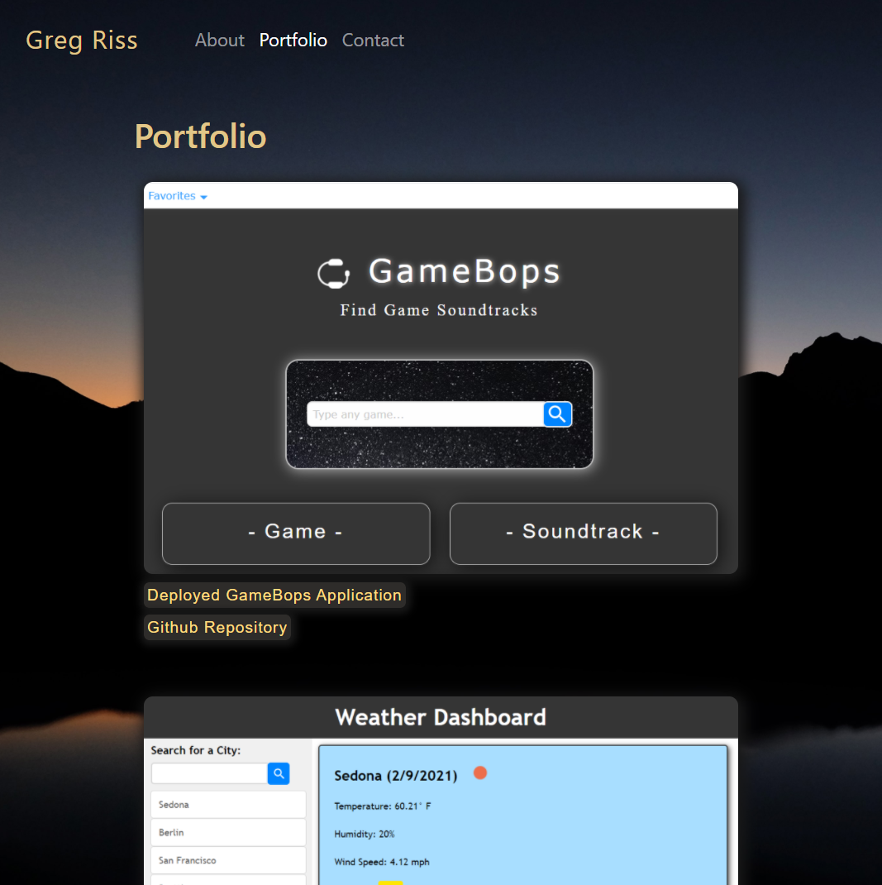
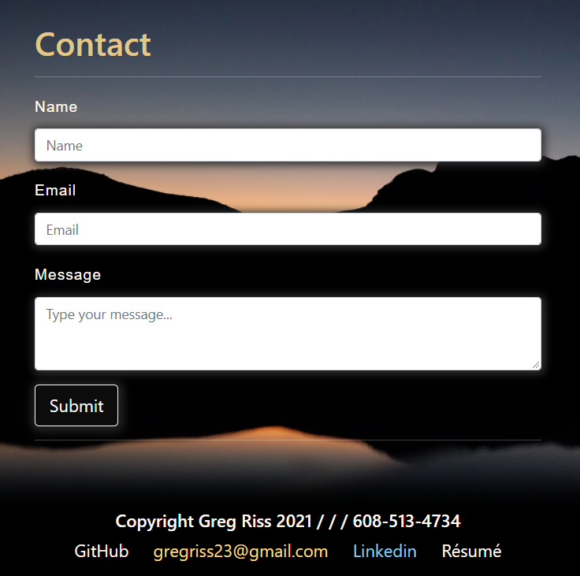

# Greg Riss's Portfolio

## Description

For this project, I built and deployed a responsive personal portfolio to showcase my Web Development projects and provide some information about myself.

The project is deployed here: https://gregriss.github.io

The code can be viewed here: https://github.com/gregriss/gregriss.github.io.git

## Usage

This website should be simple and clear to use. Use the navigation at the top of the page to find the portfolio and contact pages.

Here's a screenshot of the Homepage:

When on the Portfolio page, click on the image or one of the links below it to view the deployed application or its GitHub repository. 

To contact me via email, type your name and message in to the input fields on the Contact page. Otherwise, note my phone number and links to my GitHub profile, email address, Linkedin profile, and Resume at the bottom of each page.

## Credits

I referenced Bootstrap's documentation for this project, which can be found at:
https://getboostrap.com/docs

I also referenced https://w3schools.com for HTML and CSS documentation.

For tips about design, I referenced Gary Simon's video about UI Design: https://www.youtube.com/watch?v=0JCUH5daCCE

Finally, I referenced an article by Sara Cope at https://css-tricks.com/almanac/properties/b/box-shadow/ for box shadow documentation.

## License

Copyright (c) [2021] [Greg Riss]

Permission is hereby granted, free of charge, to any person obtaining a copy
of this software and associated documentation files (the "Software"), to deal
in the Software without restriction, including without limitation the rights
to use, copy, modify, merge, publish, distribute, sublicense, and/or sell
copies of the Software, and to permit persons to whom the Software is
furnished to do so, subject to the following conditions:

The above copyright notice and this permission notice shall be included in all
copies or substantial portions of the Software.

THE SOFTWARE IS PROVIDED "AS IS", WITHOUT WARRANTY OF ANY KIND, EXPRESS OR
IMPLIED, INCLUDING BUT NOT LIMITED TO THE WARRANTIES OF MERCHANTABILITY,
FITNESS FOR A PARTICULAR PURPOSE AND NONINFRINGEMENT. IN NO EVENT SHALL THE
AUTHORS OR COPYRIGHT HOLDERS BE LIABLE FOR ANY CLAIM, DAMAGES OR OTHER
LIABILITY, WHETHER IN AN ACTION OF CONTRACT, TORT OR OTHERWISE, ARISING FROM,
OUT OF OR IN CONNECTION WITH THE SOFTWARE OR THE USE OR OTHER DEALINGS IN THE SOFTWARE.